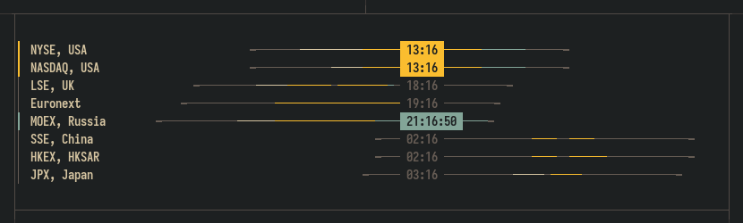

# Multiverse time
## About
Multi-timezone wall clock inspired by [everytimezone](https://everytimezone.com), for terminals.
<p align="center">
  
</p>

## Usage
> mvtime [options] [config]

where `config` is the path to the [configuration](#configuration) file, and options are

    -h, --help    Print help information
    -l, --live    Run app in live mode

see [examples](#examples) for some existing configurations

## Build
> cargo build --release

move `target/release/mvtime` binary to any location on your `PATH`


## Examples
[**EveryTimeZone**](timezones.ron) 

> mvtime -l timezones.ron 

<p align="center">
  
</p>

This example colors different times of the day throughout the planet earth. 

`Moscow/Russia` row in the middle is configured to be the 'local time' upon which other bars are positioned,\
so it is 7:59PM of yesterday(relative to local) in the US, meanwhile in Russia it is 4:59AM of today,
and New Zealand is already passed this day for a half.

[**Global assets exchanges**](markets.ron)
> mvtime -l markets.ron 

<p align="center">
  
</p>

Asset exchanges works in the different regimes throughout the day, these are common for all exchanges but differs in duration and continuity, this
example uses colors to code these:
- white regions denotes 'morning trading session', specific period at the start of the day
- yellow regions are 'main trading session'
- and blue regions are 'evening trading session'

## Configuration

Configuration file is the list of `time tracks` in the [RON](https://docs.rs/ron/latest/ron) file format.

`(tracks: [])`- minimal valid config

*Config file is reloaded automatically when changed.*

### Tracks

```
(name: "",
 shortname:  "",
 offset:     (int, int),
 show_badge: bool,
 time_label: (blink: bool, 
              seconds: bool, 
              fill: bool, 
              use_range_color: bool),
 ranges:    [(start:(int, int), end:(int, int), color: Color, fill:bool, blink:bool)])
```
- **name** - track title, optional
- **shortname** - alternative track title in compact mode, optional
- **offset** - UTC offset in 24-hour format (HH,MM)
- **show_badge** - whether to show 'badge' to the left of the title
- **time_label** - time label options
	- **blink** - controls blinking of ':', `false` by default
	- **seconds** - show seconds, `false` by default
	- **fill** - use background color, `transparent` by default
	- **use_range_color** - set active range [color](#colors) as a background
### Ranges
```
ranges: [(start:(9, 30), end:(12, 00)),
        (start:(13, 00), end:(16, 00), color: Yellow, fill:true, blink:true)]
```
- **ranges** - list of time ranges
	- **start**  - start of the range in 24-hour format (HH,MM)
	- **end** - end of the range
	- **color** - range [color](#colors)
	- **fill** - temporary overrides `time_label.fill` when current range is active
	- **blink** - temporary overrides `time_label.blink` when current range is active

### Colors
list of possible color values
```
Reset,
Black,
Red,
Green,
Yellow,
Blue,
Magenta,
Cyan,
Gray,
DarkGray,
LightRed,
LightGreen,
LightYellow,
LightBlue,
LightMagenta,
LightCyan,
White,
Rgb(u8, u8, u8)
```

*If you found some interesting usage, do miss some features, or just want to share your configuration,
feel free to fill the issue.*
